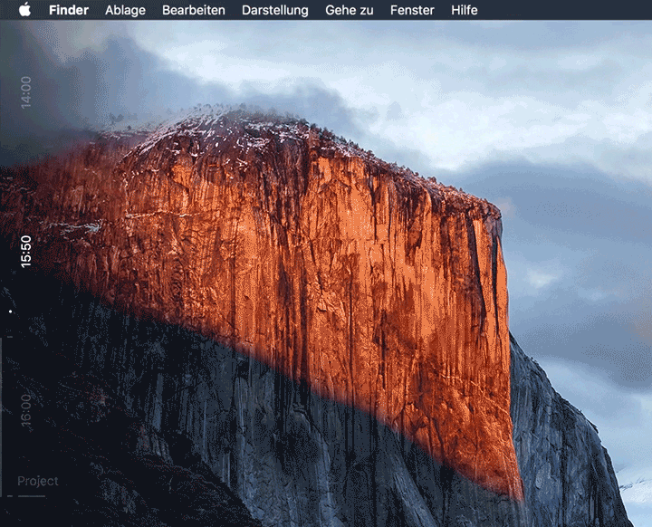

# ZeitPlan ([Übersicht](http://tracesof.net/uebersicht/) widget)

Always keep an eye on the passing time and view the events of a specific calendar in an unobtrusive, yet always visible way.

Especially if you tend to procrastinate or regularly loose track of the important projects, this works wonders.

## Preview

## Installation

Simply put the folder `zeitplan.widget` in your Übersicht widget folder. If you want to use a different calendar name, edit `line 1` in the `main.js` file and replace `Zeitplan` with your calendar name.
